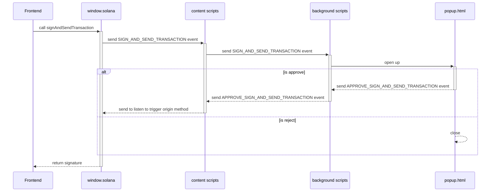

# Solana analyzer extension project

## Table of content
-   [Description](#Description)
-   [Why use it or integrate with this extension?](#why-use-it-or-integrate-with-this-extension)
-   [How it work](#how-it-work)
-   [Browser support](#browser-support)

## Description

Solana Transaction Analyzer is a powerful browser extension designed to demystify Solana transactions. It leverages advanced AI technology to translate complex transaction data into a format that's easy for humans to understand. 

With this extension, users can gain insights into the transactions they're dealing with, making the Solana blockchain more accessible and user-friendly. Whether you're a seasoned blockchain developer or a casual user, the Solana Transaction Analyzer can help you navigate the Solana ecosystem with confidence and ease.

## Why use it or integrate with this extension?

Let take a look to this [articlle](https://coinmarketcap.com/community/articles/65a5949bae1c9a56633910b3/) 

> The majority of phishing signatures on Solana involve initiating direct transfers. Although Solana supports transaction simulation, we also see methods that exploit anti-simulation and fake simulation results to confuse users and increase the likelihood of malicious signatures

So at first glance, it might seem like navigating the Solana blockchain is a daunting task, especially with the potential risks involved. This is where the Solana Transaction Analyzer extension comes into play.

Our extension serves as a protective layer, providing users with clear, understandable explanations of their transactions. By translating complex transaction data into human-readable format, it empowers users to make informed decisions about their interactions on the Solana blockchain. 

In essence, integrating with the Solana Transaction Analyzer extension not only enhances user experience but also significantly improves the security of transactions on the Solana blockchain. It's an essential tool for anyone looking to safely and effectively navigate the Solana ecosystem.

## How it work

Whenever you click something to interactingn with the wallet our extension popup first. We overwrite the `window.solana` object in DOM to handle with extension UI first. Parse it and check the programId you interacting with

## Chrome extension
The extension is pushlish in this [link]([url](https://chromewebstore.google.com/detail/transaction-analyzer/pfoaddnhhofjoadjjdfnmhoeiecickfb?authuser=0&hl=en))

## Browser Support

|  |  |  |  |  |
| --------------------------------------------------------------------------------------------- | ------------------------------------------------------------------------------------------------ | ------------------------------------------------------------------------------------------ | --------------------------------------------------------------------------------------- | ------------------------------------------------------------------------------------------ |
| 49 & later ✔                                                                                  | 52 & later ✔                                                                                     | 36 & later ✔                                                                               | 79 & later ✔                                                                            | Latest ✔                                                                                   |
