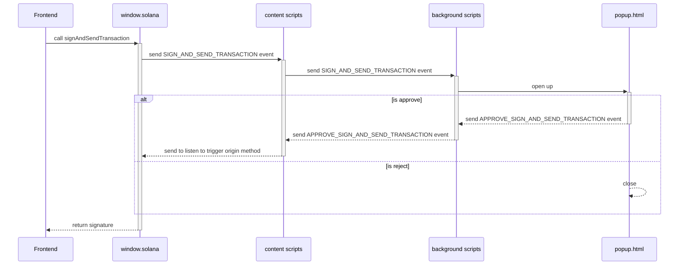

### How the popup work

```mermaid
sequenceDiagram
    Frontend->>+window.solana: call signAndSendTransaction
    window.solana->>+content scripts: send SIGN_AND_SEND_TRANSACTION event
    content scripts->>+background scripts: send SIGN_AND_SEND_TRANSACTION event
    background scripts->>+popup.html: open up
    alt is approve
    popup.html -->>- background scripts: send APPROVE_SIGN_AND_SEND_TRANSACTION event
    background scripts -->>- content scripts: send APPROVE_SIGN_AND_SEND_TRANSACTION event
    content scripts -->>- window.solana: send to listen to trigger origin method
    else is reject
    popup.html -->> popup.html: close
    end
    window.solana-->>-Frontend: return signature
```